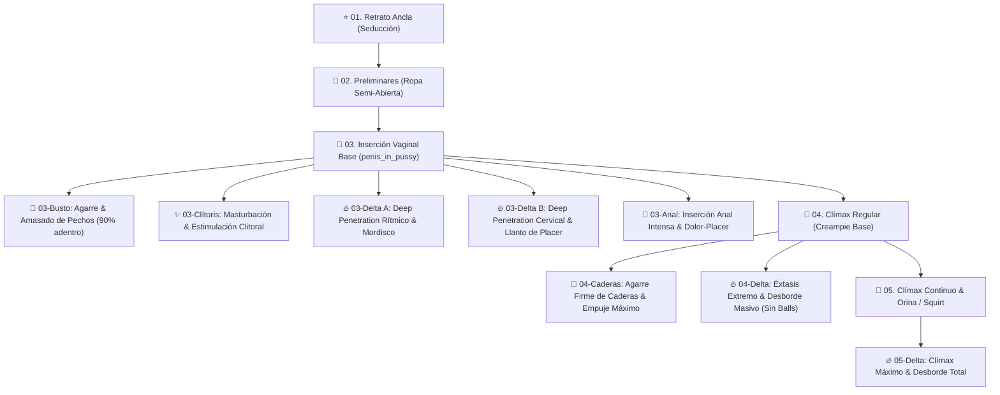

# 🎭 ComfyUI Character LoRA Vault & Multi-Modal Workflow Suite

[](https://github.com/comfyanonymous/ComfyUI)
[](#-catálogo-de-personajes-del-vault)
[](#-modalidades-de-flujos-por-personaje)
[](LICENSE)

Suite profesional y modular de flujos de trabajo (*workflows*) automatizados en **ComfyUI** para **SDXL** e **Illustrious XL**, diseñados para la generación progresiva multi-etapa, consistencia de personajes, integración de LoRAs conceptuales y control anatómico preciso.

---

## 🌟 Características Principales

* **⚡ 100% Pure Prompt Suite (`workflow_<char>_pure_prompt.json`):**
  * 13 etapas narrativas consecutivas de generación pura (`denoise: 1.0`) sin requerir preprocesadores ni imágenes de referencia.
  * Conexión directa al **VAE nativo** del checkpoint para máxima fidelidad de color y nitidez.
  * Inserción profunda del 90%, agarre y amasado de pechos, estimulación de clítoris en vivo, agarre de caderas y clímax masivo sin menciones de testículos/balls.
* **🌳 Multi-Branch Tree Delta Suite (`workflow_<char>_manual_tree_delta.json`):**
  * Arquitectura delta de 13 ramas guiada por **ControlNet Depth 3D** (MiDaS 1024) y ejecución paralela a `denoise: 1.0`.
* **👫 Pareja & ControlNet Especializado:**
  * Flujos de **Profundidad 3D** (Depth), **Esqueleto 2D** (OpenPose) y **Lineart** (Canny).
* **🔥 Doble Penetración (3 Actores):**
  * Flujo de 3 actores (ella + 2 hombres) con 2 miembros anatómicos reales simultáneos.
* **👤 Solo / POV / Paizuri:**
  * Flujo especializado para primeros planos, perspectivas POV y Paizuri en regazo sin deformidades.
* **🎨 Paleta de Color Estable:**
  * Muestreo optimizado a `24 steps`, `CFG 5.0`, `sampler: euler_ancestral` y `scheduler: karras` con bloqueo negativo de aberraciones cromáticas.

---

## 👩‍🦰 Catálogo de Personajes del Vault

| Personaje | Clave de Carpeta | LoRA de Personaje | Triggers Principales | Atributos Destacados |
| :--- | :--- | :--- | :--- | :--- |
| **Elisia** | [`elisia_make_drama`](./elisia_make_drama/) | `lora_elisia_make_drama.safetensors` | `elisia_(make_drama), elisia, make drama, demon girl, demon horns` | Curvy, hourglass, pechos gigantes, caderas anchas. |
| **Isolda** | [`isolda_lost_sword`](./isolda_lost_sword/) | `lora_isolda_lost_sword.safetensors` | `isolda_(lost_sword), isolda, lost sword, blonde hair, braided hair` | Rubia elegante, trenza larga, vestido blanco con corte lateral. |
| **Orihime** | [`orihime_swimsuit`](./orihime_swimsuit/) | `lora_orihime_swimsuit.safetensors` | `orihime_swimsuit, orihime inoue, bleach brave souls, orange hair` | Bikini micro naranja, cabello largo con broches, pechos masivos. |
| **Morgana** | [`morgana_lost_sword`](./morgana_lost_sword/) | `lora_morgana_lost_sword.safetensors` | `morgana_(lost_sword), morgana, lost sword, witch hat, purple hair` | Sombrero y túnica de bruja, cabello morado, ojos rojos. |
| **Ran** | [`ran_lost_sword`](./ran_lost_sword/) | `lora_ran_lost_sword.safetensors` | `ran_(lost_sword), ran, lost sword, fox girl, nine tails, white hair` | Chica zorro de 9 colas, kimono blanco y hakama rojo. |
| **Claire** | [`claire_lost_sword`](./claire_lost_sword/) | `lora_claire_lost_sword.safetensors` | `claire_(lost_sword), claire, lost sword, silver hair, knight, armor` | Caballero con armadura plateada y túnica azul, cabello plateado corto. |
| **Nelliel Parasol** | [`nelliel_parasol`](./nelliel_parasol/) | `lora_nelliel_parasol.safetensors` | `nelliel_parasol, nelliel tu odelschwanck, green hair, ram skull` | Kimono floral abierto, máscara Hollow / cuernos, cabello verde. |
| **Jennie** | [`jennie_make_drama`](./jennie_make_drama/) | `lora_jennie_make_drama.safetensors` | `jennie_(make_drama), jennie, make drama, teal hair, ponytail` | Office lady / traje formal, cabello cian en coleta con cinta blanca. |
| **Marcia** | [`marcia_make_drama`](./marcia_make_drama/) | `lora_marcia_make_drama.safetensors` | `marcia_(make_drama), marcia, make drama, pink hair, twintails` | Traje futurista de alta tecnología, coletas gemelas rosadas, colmillo. |
| **Nelliel Heart** | [`nelliel_heart`](./nelliel_heart/) | `lora_nelliel_heart.safetensors` | `nelliel_swimsuit, nelliel tu odelschwanck, tan, dark skin, green hair` | Versión bronceada/morena en bikini blanco y pareo floral amarillo. |

---

## 🎛️ Modalidades de Flujos por Personaje

Cada carpeta de personaje contiene los siguientes flujos JSON listos para importar a ComfyUI:

1. `workflow_<char>_pure_prompt.json` — **13 etapas ultra-rápidas sin ControlNet** (Recomendado para generación libre).
2. `workflow_<char>_manual_tree_delta.json` — **13 etapas guiadas por Depth 3D** (Recomendado para calcar poses exactas).
3. `workflow_<char>_manual_controlnet.json` — 5 etapas de pareja con MiDaS Depth.
4. `workflow_<char>_manual_openpose.json` — 5 etapas con esqueleto 2D OpenPose.
5. `workflow_<char>_manual_canny.json` — 5 etapas con detección de bordes Canny.
6. `workflow_<char>_manual_solo.json` — 5 etapas en solitario / POV / Paizuri en regazo.
7. `workflow_<char>_double_penetration.json` — 5 etapas con 3 actores y doble penetración.
8. `workflow_<char>_manual_branched.json` — 5 etapas ancla base.

---

## 🎬 Las 13 Secuencias Narrativas del Set



---

## 🏋️‍♂️ Suite de Entrenamiento LoRA & Datasets (`LoRA_Characters_Vault/`)

El repositorio incluye la suite completa de datasets curados y cuadernos de Google Colab listos para entrenar los LoRAs de los 10 personajes desde cero con Kohya ss / SD-Scripts en GPU T4/A100:

| Personaje | Carpeta de Entrenamiento | Cuaderno de Colab (.ipynb) | Dataset Comprimido (.zip) |
| :--- | :--- | :--- | :--- |
| **Elisia** | [`LoRA_Characters_Vault/01_Elisia_Make_Drama`](./LoRA_Characters_Vault/01_Elisia_Make_Drama/) | `Entrenar_LoRA_Elisia_Make_Drama_Colab.ipynb` | `dataset_elisia.zip` |
| **Isolda** | [`LoRA_Characters_Vault/02_Isolda_Lost_Sword`](./LoRA_Characters_Vault/02_Isolda_Lost_Sword/) | `Entrenar_LoRA_Isolda_Lost_Sword_Colab.ipynb` | `dataset_isolda.zip` |
| **Orihime** | [`LoRA_Characters_Vault/03_Orihime_Swimsuit`](./LoRA_Characters_Vault/03_Orihime_Swimsuit/) | `Entrenar_LoRA_Orihime_Swimsuit_Colab.ipynb` | `dataset_orihime.zip` |
| **Morgana** | [`LoRA_Characters_Vault/04_Morgana_Lost_Sword`](./LoRA_Characters_Vault/04_Morgana_Lost_Sword/) | `Entrenar_LoRA_Morgana_Lost_Sword_Colab.ipynb` | `dataset_morgana.zip` |
| **Ran** | [`LoRA_Characters_Vault/05_Ran_Lost_Sword`](./LoRA_Characters_Vault/05_Ran_Lost_Sword/) | `Entrenar_LoRA_Ran_Lost_Sword_Colab.ipynb` | `dataset_ran.zip` |
| **Claire** | [`LoRA_Characters_Vault/06_Claire_Lost_Sword`](./LoRA_Characters_Vault/06_Claire_Lost_Sword/) | `Entrenar_LoRA_Claire_Lost_Sword_Colab.ipynb` | `dataset_claire.zip` |
| **Nelliel Parasol** | [`LoRA_Characters_Vault/07_Nelliel_Parasol`](./LoRA_Characters_Vault/07_Nelliel_Parasol/) | `Entrenar_LoRA_Nelliel_Parasol_Colab.ipynb` | `dataset_nelliel.zip` |
| **Jennie** | [`LoRA_Characters_Vault/08_Jennie_Make_Drama`](./LoRA_Characters_Vault/08_Jennie_Make_Drama/) | `Entrenar_LoRA_Jennie_Make_Drama_Colab.ipynb` | `dataset_jennie.zip` |
| **Marcia** | [`LoRA_Characters_Vault/09_Marcia_Make_Drama`](./LoRA_Characters_Vault/09_Marcia_Make_Drama/) | `Entrenar_LoRA_Marcia_Make_Drama_Colab.ipynb` | `dataset_marcia.zip` |
| **Nelliel Heart** | [`LoRA_Characters_Vault/10_Nelliel_Heart`](./LoRA_Characters_Vault/10_Nelliel_Heart/) | `Entrenar_LoRA_Nelliel_Heart_Colab.ipynb` | `dataset_nelliel_heart.zip` |

---

## 🚀 Guía de Inicio Rápido

### 1. Requisitos
* [ComfyUI](https://github.com/comfyanonymous/ComfyUI) instalado y actualizado.
* Checkpoint Base: `illustriousXL_v01.safetensors` en `ComfyUI/models/checkpoints/`.
* LoRA Sliders: `pussy_adjuster_xl.safetensors` y `lora_bbc_interracial.safetensors` en `ComfyUI/models/loras/`.
* ControlNet: `controlnet-depth-sdxl-1.0.safetensors` en `ComfyUI/models/controlnet/`.

### 2. Generación Automatizada de Flujos
Para compilar o actualizar todos los flujos de los 10 personajes en simultáneo:

```bash
# Compilar suite de Prompts Puros (13 etapas sin ControlNet)
python build_vault_workflows_pure_prompt.py

# Compilar suite de Árbol 3D ControlNet (13 etapas con Depth)
python build_vault_workflows_tree_delta.py

# Compilar suites especializadas (OpenPose, Canny, Solo POV, Doble Penetración)
python build_vault_workflows_openpose.py
python build_vault_workflows_canny.py
python build_vault_workflows_solo_pov.py
python build_vault_workflows_double_penetration.py
```

### 3. Ejecución en ComfyUI
1. Abre tu interfaz de ComfyUI en el navegador.
2. Arrastra y suelta cualquiera de los archivos `.json` (ejemplo: `workflow_elisia_pure_prompt.json`).
3. Haz clic en **Queue Prompt**. ¡Las 13 etapas se generarán en paralelo con semilla fija y consistencia total!

---

## 📖 Documentación Adicional

Para ver la guía exhaustiva de prompts, combinaciones de vestimenta, presets de iluminación y moduladores de emociones, consulta:
👉 **[Guía Maestra del Vault (`LORA_CHARACTERS_VAULT_GUIDE.md`)](./LORA_CHARACTERS_VAULT_GUIDE.md)**

---

## 📜 Licencia y Descargo de Responsabilidad

Este proyecto y sus flujos de trabajo se proporcionan con fines creativos y de investigación en flujos de trabajo para IA generativa. Consulta la licencia para más detalles.
